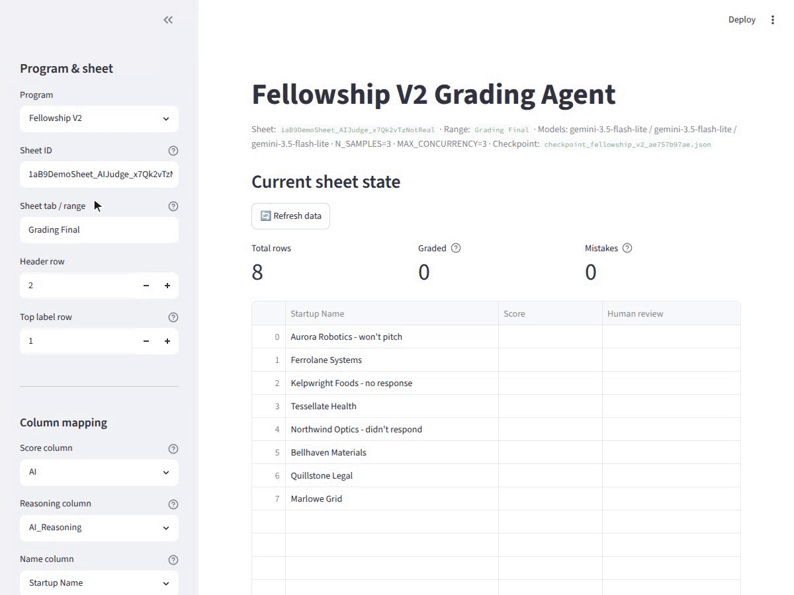
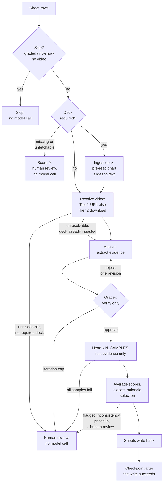

# AI Judge

[Road to Battlefield](https://road2battlefield.com), the official Central Eurasian qualifier for TechCrunch Startup Battlefield, is run by [Silkroad Innovation Hub](https://silkroadinnovationhub.com), a San Francisco hub bridging Central Eurasia and Silicon Valley. Startup Battlefield, [the world's most iconic startup pitch competition](https://techcrunch.com/startup-battlefield/about/), counts Dropbox, Discord, Fitbit, Trello, and Cloudflare among its alumni; 200 startups compete at Disrupt SF for a $100K prize. TechCrunch called the 2025 Road to Battlefield ["Central Eurasia's largest startup competition in history"](https://techcrunch.com/2025/08/25/road-to-battlefield-central-eurasias-largest-startup-competition-in-history-sends-four-winners-to-techcrunch-startup-battlefield), which sent four winners to Startup Battlefield; [the 2026 edition drew 726 applications from 39 countries](https://techcrunch.com/2026/08/12/silkroad-innovation-hubs-road-to-battlefield-competition-continues/).

AI Judge graded the Road to Battlefield finals live: pitches recorded during the event were uploaded and scored the same day, while the human judges deliberated. Since July 2026 it has graded 400+ real applications across three programs (Road to Battlefield, the Silkroad Fellowship, and the [Alchemist Silicon Valley Residency](https://alchemistsvr.com)), after gating out no-shows and rows missing their required media, which are skipped before any model call. Each application runs through a three-role Gemini workflow over pitch videos and decks: an analyst that gathers evidence and cannot score, a grader that verifies and cannot score, and a head that scores approved evidence only, sampled three times to damp run-to-run variance, with scores and rationale written back into the same Google Sheet.

This is a production system, not a demo: real applicants, real decisions, and a standing bias toward escalating to a human reviewer over silently guessing. Most of the code that looks unusual is there because of something that broke on a real batch.

Built and operated by Beibarys Nyussupov at Silkroad Innovation Hub, 2026.

## Dashboard

`app.py` is a Streamlit operator console: pick the program, then point that session at any sheet, tab and header row and map which columns hold the score, the reasoning and the applicant name. Run a single row as a test or a whole batch with live progress, and choose which columns are withheld from the model. Stop is real: it cancels in-flight model calls at the asyncio task level instead of waiting out the batch.



*Scores and rationale write back into the same Google Sheet the applications live in.*

*Demo recorded against a mocked model layer with fabricated applicants; no real data or API calls.*

## Highlights

- **Roles are separated on purpose.** The analyst extracts evidence and cannot
  score, the grader verifies it and cannot score, the head scores approved
  evidence and is told not to re-verify. That split is what makes cheap
  variance reduction possible.
- **Self-consistency sampling.** The head runs `N_SAMPLES` times (default 3) at
  temperature 0 on the same approved evidence; criterion scores are averaged
  and the published rationale comes from the run whose final score sits
  closest to the average. All three roles run at temperature 0, which the
  LLM-as-judge literature recommends for both evidence extraction and scoring
  ([arXiv:2603.28304](https://arxiv.org/abs/2603.28304)); temperature 0 alone
  does not make an LLM judge deterministic
  ([arXiv:2606.26185](https://arxiv.org/abs/2606.26185)), which is what the
  sampling is for.
- **Contracts, not vibes.** Every agent has a Pydantic output schema whose
  criterion fields are required and bounded, so an omitted, renamed, or
  out-of-range criterion fails validation, and field declaration order forces
  each rationale to be generated before its score. The variables that name
  resources (program, sheet, models, credentials) have no defaults: a
  misconfigured run dies at startup, not on row 50 of 100.
- **Two-tier media ingestion, resumable and interruptible.** Cheap path first
  (YouTube and small direct HTTPS as a URI), download path only when needed
  (Drive API, ffmpeg transcode, budget-driven shrink, PDF image recompression).
  A per-program, per-sheet checkpoint is written only after the Sheets write
  commits, and Stop cancels in-flight model calls at the asyncio task level
  instead of waiting out the batch.
- **Server-side YouTube clipping.** Operator-entered segment timestamps turn a
  full round recording into per-startup virtual clips via Gemini video
  offsets: no downloads, no cutting (`src/round_segments.py` parses the
  timestamps, `src/adk_agents/workflow.py` applies the offsets).

## Stack

- **google-adk**: agent harness; the three roles are three agents with
  separate output schemas, with the analyst-grader revision loop as a
  `LoopAgent`
- **google-genai on Vertex AI**: model access; the Gemini Developer API is a
  first-class second backend, and the code branches where the two genuinely
  differ (output schema with tools, inline bytes versus URI fetch)
- **Gemini 3.5 Flash**: the reference configuration for all three roles;
  temperature 0 everywhere, head sampled `N_SAMPLES` times (default 3). The
  model names are required environment variables with no code default
- **Python 3.12, stdlib concurrency**: `ThreadPoolExecutor` workers, one
  asyncio event loop per thread, no third-party task queue
- **Pydantic**: agent output contracts; every criterion a required, bounded
  field, each rationale declared before its score
- **Streamlit**: operator console, pinned to loopback
- **ffmpeg / ffprobe**: transcode to MP4, duration probing, budget-driven
  shrink
- **unittest**: 48 tests, all offline; no network, no Sheets, no model calls
- **ruff + GitHub Actions**: lint, format check, and the test suite on every
  push and pull request

## How one row is graded



## Programs

All three share the architecture and differ in rubric, source priority, and
sheet shape.

| Program | Criteria | Bands | Primary source | Deck | Sheet output |
|---|---|---|---|---|---|
| `fellowship_v2` | 9 | 1-2 / 3-4 / 5-6 / 7-8 / 9-10 | video | no | score and reasoning columns |
| `r2b` | 6 | 1-3 / 4-6 / 7-10 | video only | no | one column per criterion, total, notes |
| `alchemist` | 4 | 1-2 / 3-4 / 5-6 / 7-8 / 9-10 | deck and text | required | score and reasoning columns |

Every program runs at most two analyst-grader rounds, keeps the head on text
evidence only, and leaves auto-zero off. One process run grades exactly one
program.

## The judging design

The pipeline is built around one idea: an LLM that gathers evidence, judges its
own evidence, and assigns a number in a single pass is hard to audit and easy
to bias. So the three jobs go to three agents with three output schemas.

**Analyst.** Reads the video, the deck, and the application text. Its schema
forces a narrative walkthrough field first, before any per-criterion evidence,
because field order drives generation order in structured output, and the
compressed per-criterion pass alone produced miscalibrated evidence.

**Grader.** Sees the full media. Approves or rejects the analyst's evidence,
must supply actionable feedback when it rejects, and cannot emit a score. A
rejection sends the analyst back for one revision; after two rounds the row
escalates with no score.

**Head.** Scores approved evidence only and never receives the raw media. It
picks a band first and an integer inside it second, writes the rationale before
the score, and is held to a verbosity guard: score evidence quality, not pitch
length. It is re-run `N_SAMPLES` times and the criterion scores averaged, with
the rationale taken from the sample closest to the average so the numbers and
the words agree. Failed samples are dropped.

**Contradiction handling.** An earlier design auto-zeroed any application where
the model found a contradiction. Live, seven of seven auto-zeros were false
positives (currency conversion, rounding, MRR versus sales, roadmap versus
current status, "250+" versus "300+"). Today a surviving inconsistency lowers
the specific criteria where the conflicting claims live, is quoted in those
criteria's rationale, and flags the row for human review. Zeroing is a human
decision. Auto-zero remains a per-program flag, currently off everywhere.

## Production hardening

Each of these is a comment in the code attached to something that actually
failed.

- **One event loop per worker thread, not per row.** Per-row `asyncio.run()`
  left the ADK's cached HTTP client bound to a closed loop: 44 of 69 failures
  in one 100-row batch (`src/adk_agents/workflow.py`).
- **The head receives no media.** Concurrent head samples each carrying an
  inline video (~95 MB) all failed at once with 400 INVALID_ARGUMENT; removing
  media from the head fixed it structurally rather than by backing off
  concurrency (`src/adk_agents/workflow.py`).
- **Concurrency stays low.** Raising it to 8 produced sustained 429s in a real
  100-row run, root-caused to one oversized payload exhausting a trial-tier
  quota with no contention at all (`src/config.py`).
- **Cancellation cannot use `as_completed()`.** A future cancelled straight off
  the executor queue never reaches CANCELLED_AND_NOTIFIED, so no waiter fires
  and the loop blocks forever; the completion loop uses bounded `wait()` plus
  an explicit `done()` recheck, with a regression test (`src/pipeline.py`,
  `tests/test_cancellation.py`).
- **Media is normalized before it is sent.** A real `.webm` labeled `video/mp4`
  returns an opaque 400; an MP4 with its moov atom at the end cannot be
  demuxed from a pipe (found on a 233 MB upload); Vertex's server-side URI
  fetch caps at 15 MB while inline bytes cap near 95 MB, so ingestion picks
  the path by measured size; image-only deck slides are pre-read to text in
  one bundled call because models read charts reliably in isolation but not
  inside a large multimodal context
  ([arXiv:2406.11230](https://arxiv.org/abs/2406.11230))
  (`src/video_ingestion.py`, `src/adk_agents/workflow.py`).
- **Real sheets are messy.** Checkpoints are scoped per program and per sheet
  after a global path made one program adopt another's rows; the same email
  appears on genuinely different applications (5 silent collisions in one
  sheet); a batch with 11 no-shows reported 13 failed when 2 had failed; a
  trailing space in a header showed a fully graded sheet as empty
  (`src/config.py`, `src/pipeline.py`, `src/google_clients.py`, `app.py`).

## Security model and known limitations

The threat model is a hostile applicant: anyone can type an arbitrary string
into a form cell that this pipeline will fetch, parse, or hand to a model.

Defended:

- Every applicant-driven fetch, in both the metadata tier and the download
  tier, is HTTPS-only; rejects private, loopback, link-local, and NAT64
  addresses; and validates every redirect hop. Download-tier requests run
  through an opener that cannot dispatch `file:`, `ftp:`, or `data:` schemes
  at all; the metadata tier blocks those schemes at its HTTPS-only check
  (`src/video_urls.py`, `src/video_ingestion.py`).
- The Drive API is invoked only for links on Google hosts, so an applicant
  cannot point the service account at an arbitrary file ID
  (`src/google_clients.py`).
- PDF image decoding is capped at 40 megapixels, so a decompression-bomb deck
  cannot exhaust memory (`src/video_ingestion.py`).
- The dashboard binds to 127.0.0.1 with no authentication: one operator, one
  machine; remote access means a tunnel (`run_app.sh`).
- Sheet writes use raw value input, so model rationale beginning with `=` or
  `+` is stored as text, never evaluated; scores are schema-bounded (1-10) and
  each applicant is graded in an isolated session, which also caps the payoff
  of prompt injection.

Known limitations, deliberately deferred (each has a recorded fix; all were
judged to need a live production re-test or a refactor larger than a
publication cleanup should carry):

- DNS rebinding between validation and connection is not defended; hosts are
  checked, then re-resolved at connect time.
- Non-default HTTPS ports are allowed.
- Applicant text reaches model instructions without injection fencing; the
  bounds above cap the damage, but tone can be biased.
- Contact columns (email, phone, handles) reach the model on two of the three
  programs; the dashboard's column picker mitigates interactive runs, the CLI
  does not.
- Downloads are held in memory up to 2 GB each, times `MAX_CONCURRENCY`.
- Checkpoint keys are unsalted SHA-256 of applicant emails: not reversible, but
  confirmable against a candidate list.
- Transitive dependencies carry published advisories (the direct pins are
  clean); upgrades are scheduled.
- The single-column final score uses banker's rounding (4.5 rounds to 4, 5.5
  to 6). It reaches the sheet as a text cell only on that path's batched
  write, used when the score and reasoning columns are adjacent; the
  non-adjacent fallback and the multi-column path write it as a number.
- Column-name matching differs across the three resolvers (exact,
  whitespace-normalized, case-folded).
- A corrupt checkpoint file crashes the batch rather than recovering.
- No logging: best-effort paths degrade silently.

## Setup

Requires Python 3.12 and the ffmpeg and ffprobe binaries on PATH: the ingestion
layer shells out to both to transcode and shrink oversized videos, so a
missing binary surfaces as a mid-batch `FileNotFoundError`, not a startup
error.

```bash
git clone https://github.com/NBeibarys/Project-AI-Judge.git
cd Project-AI-Judge
python -m pip install -r requirements.txt
cp .env.example .env
```

Create a Google service account, download its JSON key, share the target Sheet
with its email as an Editor, and share any Drive-hosted videos or decks with
the same email. Model access is either Vertex AI (`GOOGLE_GENAI_USE_VERTEXAI=TRUE`
plus `GOOGLE_CLOUD_PROJECT` and `GOOGLE_CLOUD_LOCATION`) or the Gemini Developer
API (`GOOGLE_API_KEY`); the backends genuinely differ (Files API and tool-config
handling versus inline bytes). The reference configuration in `.env.example`
uses gemini-3.5-flash for all three roles; production has also run the
cheaper flash-lite tiers (gemini-3.1-flash-lite, later gemini-3.5-flash-lite),
whose lower reliability is documented in `src/config.py` and is what the verify
loop and multi-sample averaging mitigate.

Required, no defaults; each raises at startup if unset:

| Variable | Notes |
|---|---|
| `PROGRAM` | `fellowship_v2`, `r2b`, or `alchemist`; CLI only, the dashboard has its own picker |
| `GOOGLE_SERVICE_ACCOUNT_PATH` | must point at an existing file |
| `FELLOWSHIP_V2_SHEET_ID` / `R2B_SHEET_ID` / `ALCHEMIST_SHEET_ID` | whichever program you run |
| `ANALYZER_MODEL`, `GRADER_MODEL` | no fallback tier; a past commit silently downgraded every model |
| `GOOGLE_CLOUD_PROJECT` + `GOOGLE_CLOUD_LOCATION`, or `GOOGLE_API_KEY` | Vertex, or Developer API |

Optional: `HEAD_MODEL` (defaults to `GRADER_MODEL`), `N_SAMPLES`,
`MAX_CONCURRENCY`, and the per-program sheet-geometry variables. There is no
checkpoint-path variable: each run derives
`checkpoint_{program}_{sheet_hash}.json`.

The dashboard has no authentication, so its loopback binding is pinned in two
places and neither launch path can widen it by accident: `.streamlit/config.toml`
sets `server.address = "127.0.0.1"`, and `run_app.sh` passes the same flag.
Remote access means an SSH tunnel.

## Running

```bash
PROGRAM=r2b python -m src.main            # batch, resuming from the checkpoint
PROGRAM=r2b FORCE=1 python -m src.main    # re-grade every row
streamlit run app.py                      # or ./run_app.sh
```

The CLI prints graded and error counts and exits non-zero if any row failed.
The dashboard can also grade a single row, bypassing the checkpoint, to test a
prompt or config change.

## Testing

```bash
python -m unittest discover -s tests -p 'test_*.py'
```

48 tests, all offline: no network, no Sheets, no model calls. They cover the
deterministic core: timestamp parsing and segment bounds, YouTube URL
canonicalization, no-show detection, schema field ordering and head-output
conversion, config env handling and sheet-range rejection, escalation write
shapes and the inline-video segment escalation, the cancellation paths
including a regression test for the executor-queue hang, and the SSRF and
host-allowlist guards. They do not cover the agents, Sheets writes, or media
ingestion, and the averaging arithmetic only through its empty-input
escalation test; the rest was validated against real production sheets,
which is honest but not a substitute for tests.

## Development history

The commit history is preserved back to June 2026; operational files
(deployment configs, result dumps, internal planning documents) were stripped
before publication, and the private archive that retains them stays private
because early revisions contain applicant data. What the log alone does not
show is which decisions production reversed:

- **Auto-zero on internal contradictions**, added 2026-07-11 and reversed
  07-12: 7 of 7 live auto-zeros were false positives (currency conversion,
  rounding, MRR versus sales, roadmap versus current status, "250+" versus
  "300+"). A contradiction now lowers the specific criteria involved and flags
  the row; zeroing is a human decision.
- **A 4-agent web-verifier pipeline**, built and removed the same day
  (2026-07-06).
- **The automatic segment-timestamp proposer** (2026-07-15), replaced by
  operator-entered boundaries.
- **Grading R2B rows with no video link** as "no video submitted", reversed
  2026-07-20: those rows are skipped outright rather than scored on absent
  evidence.
- **The Cloud Run deployment**, added 2026-07-06 and removed 07-17.

## Repository layout

```
app.py                    Streamlit operator dashboard (run_app.sh launches it)
src/main.py               CLI entry point
src/config.py             Env-driven config, fail-fast validation
src/programs.py           Per-program rubrics, prompts, sheet geometry
src/pipeline.py           Batch driver: gating, concurrency, write-back
src/checkpoint.py         Resumable, pseudonymized row state
src/google_clients.py     Sheets access, column resolution, Drive link parsing
src/video_urls.py         Tier-1 URL resolution, SSRF and size guards
src/video_ingestion.py    Tier-2 download, transcode, deck ingestion
src/adk_agents/           Agents, prompts, schemas, workflow
src/round_segments.py     Timestamp parsing for virtual clips
tests/                    Offline unit tests
assets/                   Dashboard demo GIF used by this README
```

## License

MIT. See [LICENSE](LICENSE).
