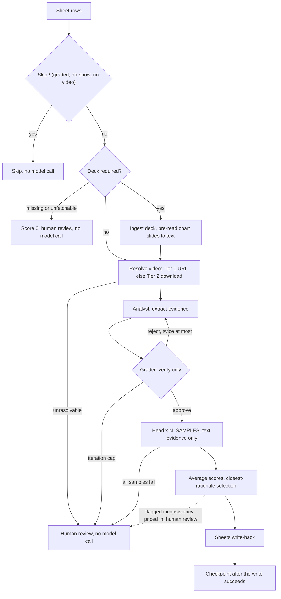
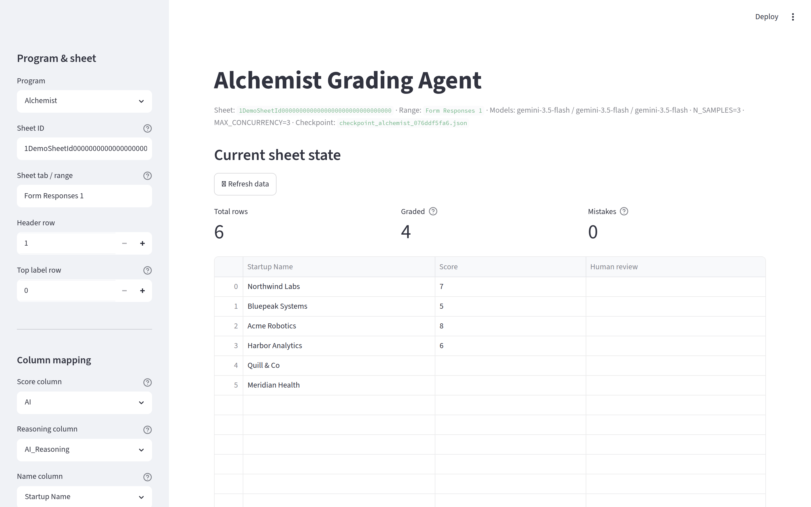

# ai-judge

A multi-agent grading pipeline for startup and fellowship applications that live
in Google Sheets. It reads a sheet, pulls each applicant's pitch video and pitch
deck, runs a three-role Gemini workflow over them (an analyst that only gathers
evidence, a grader that only verifies it, a head reviewer that only scores it),
samples the scorer to damp run-to-run variance, and writes scores and rationale
back into the same sheet. It has processed 140+ real applications across three
programs since July 2026, and most of the code that looks unusual is there
because of something that broke on a real batch.

This is a production system, not a demo: real applicants, real decisions, and
a standing bias toward escalating to a human reviewer over silently guessing.

## Highlights

- **Roles are separated on purpose.** The analyst extracts evidence and cannot
  score, the grader verifies it and cannot score, the head scores approved
  evidence and is told not to re-verify. That split is what makes cheap
  variance reduction possible.
- **Self-consistency sampling.** The head runs `N_SAMPLES` times (default 3) at
  temperature 0 on the same approved evidence; criterion scores are averaged
  and the published rationale comes from the run whose final score sits
  closest to the average (arXiv:2606.26185: temperature 0 alone does not make
  an LLM judge deterministic).
- **Contracts, not vibes.** Every agent has a Pydantic output schema whose
  criterion fields are required and bounded, so an omitted, renamed, or
  out-of-range criterion fails validation, and field declaration order forces
  each rationale to be generated before its score. The variables that name
  resources (program, sheet, models, credentials) have no defaults: a
  misconfigured run dies at startup, not on row 50 of 100.
- **Two-tier media ingestion, resumable and interruptible.** Cheap path first
  (YouTube and small direct HTTPS as a URI), download path only when needed
  (Drive API, ffmpeg transcode, budget-driven shrink, PDF image recompression).
  A per-program, per-sheet checkpoint is written only after the Sheets write
  commits, and Stop cancels in-flight model calls at the asyncio task level
  instead of waiting out the batch.
- **Server-side YouTube clipping.** Operator-entered segment timestamps turn a
  full round recording into per-startup virtual clips via Gemini video
  offsets: no downloads, no cutting (`src/round_segments.py`).

## How one row is graded



## The judging design

The pipeline is built around one idea: an LLM that gathers evidence, judges its
own evidence, and assigns a number in a single pass is hard to audit and easy
to bias. So the three jobs go to three agents with three output schemas.

**Analyst.** Reads the video, the deck, and the application text. Its schema
forces a narrative walkthrough field first, before any per-criterion evidence,
because field order drives generation order in structured output, and the
compressed per-criterion pass alone produced miscalibrated evidence.

**Grader.** Sees the full media. Approves or rejects the analyst's evidence,
must supply actionable feedback when it rejects, and cannot emit a score. A
rejection sends the analyst back for one revision; after two rounds the row
escalates with no score.

**Head.** Scores approved evidence only and never receives the raw media. It
picks a band first and an integer inside it second, writes the rationale before
the score, and is held to a verbosity guard: score evidence quality, not pitch
length. It is re-run `N_SAMPLES` times and the criterion scores averaged, with
the rationale taken from the sample closest to the average so the numbers and
the words agree. Failed samples are dropped.

**Contradiction handling.** An earlier design auto-zeroed any application where
the model found a contradiction. Live, seven of seven auto-zeros were false
positives (currency conversion, rounding, MRR versus sales, roadmap versus
current status, "250+" versus "300+"). Today a surviving inconsistency lowers
the specific criteria where the conflicting claims live, is quoted in those
criteria's rationale, and flags the row for human review. Zeroing is a human
decision. Auto-zero remains a per-program flag, currently off everywhere.

## Programs

All three share the architecture and differ in rubric, source priority, and
sheet shape.

| Program | Criteria | Bands | Primary source | Deck | Sheet output |
|---|---|---|---|---|---|
| `fellowship_v2` | 9 | 1-2 / 3-4 / 5-6 / 7-8 / 9-10 | video | no | score and reasoning columns |
| `r2b` | 6 | 1-3 / 4-6 / 7-10 | video only | no | one column per criterion, total, notes |
| `alchemist` | 4 | 1-2 / 3-4 / 5-6 / 7-8 / 9-10 | deck and text | required | score and reasoning columns |

Every program runs at most two analyst-grader rounds, keeps the head on text
evidence only, and leaves auto-zero off. One process run grades exactly one
program.

## Production hardening

Each of these is a comment in the code attached to something that actually
failed.

- **One event loop per worker thread, not per row.** Per-row `asyncio.run()`
  left the ADK's cached HTTP client bound to a closed loop: 44 of 69 failures
  in one 100-row batch (`src/adk_agents/workflow.py`).
- **The head receives no media.** Concurrent head samples each carrying an
  inline video (~95 MB) all failed at once with 400 INVALID_ARGUMENT; removing
  media from the head fixed it structurally rather than by backing off
  concurrency (`src/adk_agents/workflow.py`).
- **Concurrency stays low.** Raising it to 8 produced sustained 429s in a real
  100-row run, root-caused to one oversized payload exhausting a trial-tier
  quota with no contention at all (`.env.example`).
- **Cancellation cannot use `as_completed()`.** A future cancelled straight off
  the executor queue never reaches CANCELLED_AND_NOTIFIED, so no waiter fires
  and the loop blocks forever; the completion loop uses bounded `wait()` plus
  an explicit `done()` recheck, with a regression test (`src/pipeline.py`,
  `tests/test_cancellation.py`).
- **Media is normalized before it is sent.** A real `.webm` labeled `video/mp4`
  returns an opaque 400; an MP4 with its moov atom at the end cannot be
  demuxed from a pipe (found on a 233 MB upload); Vertex's server-side URI
  fetch caps at 15 MB while inline bytes cap near 95 MB, so ingestion picks
  the path by measured size; image-only deck slides are pre-read to text in
  one bundled call because models read charts reliably in isolation but not
  inside a large multimodal context (arXiv:2406.11230)
  (`src/video_ingestion.py`).
- **Real sheets are messy.** Checkpoints are scoped per program and per sheet
  after a global path made one program adopt another's rows; the same email
  appears on genuinely different applications (5 silent collisions in one
  sheet); a batch with 11 no-shows reported 13 failed when 2 had failed; a
  trailing space in a header showed a fully graded sheet as empty
  (`src/config.py`, `src/pipeline.py`, `src/google_clients.py`).

## Security model and known limitations

The threat model is a hostile applicant: anyone can type an arbitrary string
into a form cell that this pipeline will fetch, parse, or hand to a model.

Defended:

- Every applicant-driven fetch, in both the metadata tier and the download
  tier, is HTTPS-only; rejects private, loopback, link-local, and NAT64
  addresses; validates every redirect hop; and runs through an opener that
  cannot dispatch `file:`, `ftp:`, or `data:` schemes at all
  (`src/video_urls.py`, `src/video_ingestion.py`).
- The Drive API is invoked only for links on Google hosts, so an applicant
  cannot point the service account at an arbitrary file ID
  (`src/google_clients.py`).
- PDF image decoding is capped at 40 megapixels, so a decompression-bomb deck
  cannot exhaust memory (`src/video_ingestion.py`).
- The dashboard binds to 127.0.0.1 with no authentication: one operator, one
  machine; remote access means a tunnel (`run_app.sh`).
- Sheet writes use raw value input, so model rationale beginning with `=` or
  `+` is stored as text, never evaluated; scores are schema-bounded (1-10) and
  each applicant is graded in an isolated session, which also caps the payoff
  of prompt injection.

Known limitations, deliberately deferred (each has a recorded fix; all were
judged to need a live production re-test or a refactor larger than a
publication cleanup should carry):

- DNS rebinding between validation and connection is not defended; hosts are
  checked, then re-resolved at connect time.
- Non-default HTTPS ports are allowed.
- Applicant text reaches model instructions without injection fencing; the
  bounds above cap the damage, but tone can be biased.
- Contact columns (email, phone, handles) reach the model on two of the three
  programs; the dashboard's column picker mitigates interactive runs, the CLI
  does not.
- Downloads are held in memory up to 2 GB each, times `MAX_CONCURRENCY`.
- Checkpoint keys are unsalted SHA-256 of applicant emails: not reversible, but
  confirmable against a candidate list.
- Transitive dependencies carry published advisories (the direct pins are
  clean); upgrades are scheduled.
- The single-column final score uses banker's rounding (4.5 rounds to 4, 5.5
  to 6) and is written as a text cell.
- Column-name matching differs across the three resolvers (exact,
  whitespace-normalized, case-folded).
- A corrupt checkpoint file crashes the batch rather than recovering.
- No logging: best-effort paths degrade silently.

## Dashboard

`app.py` is a Streamlit operator console: pick the program, point it at any
sheet, tab and header row, map which columns hold the score, the reasoning and
the applicant name, choose which columns are hidden from the model, run a batch
or a single row, and stop a run mid-flight (which cancels in-flight model calls
rather than waiting them out). It binds to loopback and has no authentication:
remote access means an SSH tunnel.



## Setup

Requires Python 3.12 and the ffmpeg and ffprobe binaries on PATH: the ingestion
layer shells out to both to transcode and shrink oversized videos, so a
missing binary surfaces as a mid-batch `FileNotFoundError`, not a startup
error.

```bash
python -m pip install -r requirements.txt
cp .env.example .env
```

Create a Google service account, download its JSON key, share the target Sheet
with its email as an Editor, and share any Drive-hosted videos or decks with
the same email. Model access is either Vertex AI (`GOOGLE_GENAI_USE_VERTEXAI=TRUE`
plus `GOOGLE_CLOUD_PROJECT` and `GOOGLE_CLOUD_LOCATION`) or the Gemini Developer
API (`GOOGLE_API_KEY`); the backends genuinely differ (Files API and tool-config
handling versus inline bytes). Production runs Vertex AI with
gemini-3.5-flash in all three roles, a cost and reliability tradeoff
documented in `.env.example`.

Required, no defaults; each raises at startup if unset:

| Variable | Notes |
|---|---|
| `PROGRAM` | `fellowship_v2`, `r2b`, or `alchemist`; CLI only, the dashboard has its own picker |
| `GOOGLE_SERVICE_ACCOUNT_PATH` | must point at an existing file |
| `FELLOWSHIP_V2_SHEET_ID` / `R2B_SHEET_ID` / `ALCHEMIST_SHEET_ID` | whichever program you run |
| `ANALYZER_MODEL`, `GRADER_MODEL` | no fallback tier; a past commit silently downgraded every model |
| `GOOGLE_CLOUD_PROJECT` + `GOOGLE_CLOUD_LOCATION`, or `GOOGLE_API_KEY` | Vertex, or Developer API |

Optional: `HEAD_MODEL` (defaults to `GRADER_MODEL`), `N_SAMPLES`,
`MAX_CONCURRENCY`, and the per-program sheet-geometry variables. There is no
checkpoint-path variable: each run derives
`checkpoint_{program}_{sheet_hash}.json`.

## Running

```bash
PROGRAM=r2b python -m src.main            # batch, resuming from the checkpoint
PROGRAM=r2b FORCE=1 python -m src.main    # re-grade every row
streamlit run app.py                      # or ./run_app.sh
```

The CLI prints graded and error counts and exits non-zero if any row failed.
The dashboard can also grade a single row, bypassing the checkpoint, to test a
prompt or config change.

## Testing

```bash
python -m unittest discover -s tests -p 'test_*.py'
```

48 tests, all offline: no network, no Sheets, no model calls. They cover the
deterministic core: timestamp parsing and segment bounds, YouTube URL
canonicalization, no-show detection, schema field ordering and head-output
conversion, the cancellation paths including a regression test for the
executor-queue hang, and the SSRF and host-allowlist guards. They do not cover
the agents, Sheets writes, media ingestion, or the averaging arithmetic; those
were validated against real production sheets, which is honest but not a
substitute for tests.

## Design notes

- [R2B video-only grading](docs/design/2026-07-10-r2b-video-only-grading-design.md)
- [Kill in-flight grading](docs/design/2026-07-21-kill-in-flight-grading-design.md)

Both carry a status header noting which of their decisions the code later
reversed.

## Development history

The commit history is preserved back to June 2026. Operational files
(deployment configs, result dumps, internal planning documents) were stripped
from history before publication; the private development archive retains them.
The arc, with reasons the log alone does not show:

- 2026-06-27: initial multimodal fellowship review on Google ADK.
- 2026-07-06: R2B and Alchemist programs added; a 4-agent web-verifier
  pipeline tried and removed the same day; Cloud Run deployment added.
- 2026-07-07: switched to the Gemini Developer API, then back to Vertex AI
  within two weeks; the model-aware tool config and schema fixes remain.
- 2026-07-10: R2B video-only grading with one sheet column per criterion;
  internal-contradiction auto-zero added 07-11 and reversed 07-12 after 7 of 7
  live auto-zeros proved false.
- 2026-07-15: round indexing and server-side YouTube segment clipping; the
  automatic timestamp proposer later removed in favor of operator-entered
  boundaries.
- 2026-07-17: Cloud Run deployment files removed.
- 2026-07-20: Alchemist and Fellowship V2 aligned to R2B's tuning (media-less
  head, priced contradictions, 2-iteration verify cap).
- 2026-07-21: dashboard column mapping, single-row test grading, and the
  kill-in-flight Stop button.

Dates and pivot reasons come from the private development archive, which stays
private because early revisions contain applicant data.

## Repository layout

```
app.py                    Streamlit operator dashboard (run_app.sh launches it)
src/main.py               CLI entry point
src/config.py             Env-driven config, fail-fast validation
src/programs.py           Per-program rubrics, prompts, sheet geometry
src/pipeline.py           Batch driver: gating, concurrency, write-back
src/checkpoint.py         Resumable, pseudonymized row state
src/google_clients.py     Sheets and Drive access, column resolution
src/video_urls.py         Tier-1 URL resolution, SSRF and size guards
src/video_ingestion.py    Tier-2 download, transcode, deck ingestion
src/adk_agents/           Agents, prompts, schemas, workflow
src/round_segments.py     Timestamp parsing for virtual clips
tests/                    Offline unit tests
docs/design/              Design notes with status headers
```

## License

MIT. See [LICENSE](LICENSE).
